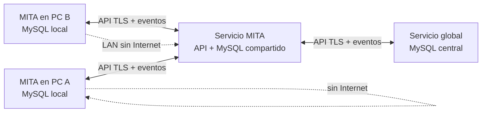

# Arquitectura offline, red local e Internet

## Decisión

Sí es posible satisfacer los tres casos sin SQLite: se usan **dos bases MySQL**, ambas con el mismo esquema y con una cola de sincronización también en MySQL.

1. `mita_local`: corre en cada computadora y permite continuar sin Internet ni red.
2. `mita_red`: corre en una PC/servidor de la residencia o en un servidor global y consolida los datos compartidos.

MongoDB no es necesario para datos clínicos. Si se conserva, sólo debe almacenar telemetría anónima; identidades, mensajes, progreso y reportes permanecen en MySQL.

El diagrama representa el objetivo de la siguiente fase. La aplicación actual ya es MySQL-only y crea las tablas de conversaciones, mensajes y reportes; todavía no incluye el agente de sincronización ni la pantalla de mensajes privados.

## Comportamiento esperado

| Situación | Dónde se guarda | Qué sigue funcionando |
| --- | --- | --- |
| PC aislada | `mita_local` de esa PC | Todas las funciones locales; los cambios quedan en la cola MySQL. |
| Geriátrico con LAN sin Internet | MySQL y API de la PC servidor local | Mensajes, comunidad, reportes y progreso entre equipos de esa red. |
| Internet disponible | MySQL global a través de la API | Los datos permitidos se sincronizan entre sedes, familiares y profesionales. |

No se debe conectar la aplicación de escritorio directamente a un MySQL expuesto en Internet. La API es la única que abre conexión a la base compartida, verifica permisos y registra auditoría.

## Sincronización fiable

Cada operación local debe crear un evento con UUID, `origen_dispositivo`, versión y fecha UTC dentro de una tabla `sync_outbox` de MySQL. El servicio remoto confirma el UUID de forma idempotente y lo guarda en `sync_inbox`; así, una reconexión no duplica actividades, mensajes ni reportes.

- Las actividades, mensajes y reportes son eventos inmutables: se añaden, no se sobrescriben.
- Preferencias o perfiles usan versión optimista; ante conflicto se muestra una comparación al cuidador.
- Los reportes se comparten con destinatarios explícitos y permisos revocables. Las tablas `reportes_progreso` y `reporte_destinatarios` ya preparan ese modelo.
- Un mensaje se ve sólo si la API confirma que el usuario participa en esa conversación. Las tablas de participantes, mensajes y recibos de lectura ya están creadas.

## Seguridad mínima obligatoria

- Usuario MySQL dedicado por entorno, sin usar `root` desde la aplicación ni desde los equipos cliente.
- Contraseñas con PBKDF2, sal única y comparación segura; MITA ya aplica este formato para cuentas nuevas.
- API con TLS, sesiones cortas y renovación de token; para la LAN también TLS con certificado interno o VPN.
- Cifrado de disco en cada PC y copias de seguridad cifradas. Cifrar adicionalmente campos clínicos sensibles con claves que no estén en la base.
- Control de acceso por rol y por relación explícita: familiar autorizado, adulto, cuidador o administrador. Nunca derivar el acceso sólo del correo o del rol.
- Auditoría de lectura/compartición de reportes, retención definida, revocación, copia de seguridad restaurable y revisión profesional de los requisitos legales mexicanos aplicables.

## Hospedaje sin costo: alternativa realista

Para un piloto, la alternativa más estable y realmente sin cuota es una PC del geriátrico encendida que ejecute MySQL y el servicio MITA; el costo es electricidad, respaldo y mantenimiento. Para acceso mundial puede usarse una VM Always Free de Oracle Cloud con MySQL y la API, pero Oracle advierte que las instancias Always Free inactivas pueden recuperarse; no debe ser el único respaldo. [Oracle Free Tier](https://docs.oracle.com/en-us/iaas/Content/FreeTier/freetier.htm)

Una VPN de malla evita abrir puertos de MySQL. Tailscale ofrece un plan personal gratuito limitado a seis usuarios; para una residencia o servicio real hay que revisar y contratar el plan que corresponda, no asumir que el plan personal cubre la organización. [Límites de Tailscale](https://tailscale.com/docs/reference/free-plans-discounts)

## Próxima implementación propuesta

1. Instalar MySQL local en cada PC y crear `mita_local`; añadir las tablas de cola MySQL y el identificador de dispositivo.
2. Crear el servicio MITA (FastAPI) con autenticación, permisos y API de mensajes/reportes.
3. Añadir el agente de sincronización en segundo plano con reintentos y pantalla de estado; probar cortes de red y conflictos.
4. Implementar la bandeja de conversaciones y el flujo de compartir reporte con consentimiento explícito.
5. Realizar pruebas de seguridad, respaldo/restauración y revisión legal antes de guardar información clínica real.

